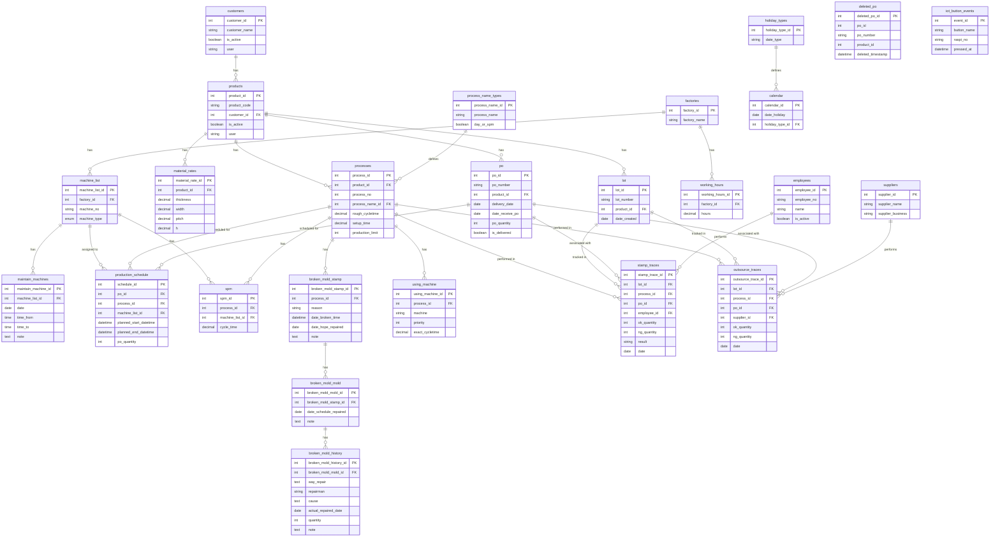

# Database Entity-Relationship Diagram

```mermaid
erDiagram
    customers ||--o{ products : "has"
    products ||--o{ processes : "has"
    products ||--o{ material_rates : "has"
    products ||--o{ lot : "has"
    products ||--o{ po : "has"
    
    process_name_types ||--o{ processes : "defines"
    
    factories ||--o{ machine_list : "has"
    factories ||--o{ working_hours : "has"
    
    machine_list ||--o{ maintain_machines : "has"
    machine_list ||--o{ production_schedule : "assigned to"
    machine_list ||--o{ spm : "has"
    
    processes ||--o{ broken_mold_stamp : "has"
    processes ||--o{ using_machine : "has"
    processes ||--o{ stamp_traces : "performed in"
    processes ||--o{ outsource_traces : "performed in"
    processes ||--o{ production_schedule : "scheduled for"
    processes ||--o{ spm : "has"
    
    broken_mold_stamp ||--o{ broken_mold_mold : "has"
    broken_mold_mold ||--o{ broken_mold_history : "has"
    
    holiday_types ||--o{ calendar : "defines"
    
    lot ||--o{ stamp_traces : "tracked in"
    lot ||--o{ outsource_traces : "tracked in"
    
    po ||--o{ stamp_traces : "associated with"
    po ||--o{ outsource_traces : "associated with"
    po ||--o{ production_schedule : "scheduled for"
    
    employees ||--o{ stamp_traces : "performs"
    
    suppliers ||--o{ outsource_traces : "performs"

    customers {
        int customer_id PK
        string customer_name
        boolean is_active
        string user
    }

    products {
        int product_id PK
        string product_code
        int customer_id FK
        boolean is_active
        string user
    }

    process_name_types {
        int process_name_id PK
        string process_name
        boolean day_or_spm
    }

    processes {
        int process_id PK
        int product_id FK
        int process_no
        int process_name_id FK
        decimal rough_cycletime
        decimal setup_time
        int production_limit
    }

    factories {
        int factory_id PK
        string factory_name
    }

    machine_list {
        int machine_list_id PK
        int factory_id FK
        string machine_no
        enum machine_type
    }

    maintain_machines {
        int maintain_machine_id PK
        int machine_list_id FK
        date date
        time time_from
        time time_to
        text note
    }

    broken_mold_stamp {
        int broken_mold_stamp_id PK
        int process_id FK
        string reason
        datetime date_broken_time
        date date_hope_repaired
        text note
    }

    broken_mold_mold {
        int broken_mold_mold_id PK
        int broken_mold_stamp_id FK
        date date_schedule_repaired
        text note
    }

    broken_mold_history {
        int broken_mold_history_id PK
        int broken_mold_mold_id FK
        text way_repair
        string repairman
        text cause
        date actual_repaired_date
        int quantity
        text note
    }

    using_machine {
        int using_machine_id PK
        int process_id FK
        string machine
        int priority
        decimal exact_cycletime
    }

    working_hours {
        int working_hours_id PK
        int factory_id FK
        decimal hours
    }

    holiday_types {
        int holiday_type_id PK
        string date_type
    }

    calendar {
        int calendar_id PK
        date date_holiday
        int holiday_type_id FK
    }

    material_rates {
        int material_rate_id PK
        int product_id FK
        decimal thickness
        decimal width
        decimal pitch
        decimal h
    }

    spm {
        int spm_id PK
        int process_id FK
        int machine_list_id FK
        decimal cycle_time
    }

    lot {
        int lot_id PK
        string lot_number
        int product_id FK
        date date_created
    }

    po {
        int po_id PK
        string po_number
        int product_id FK
        date delivery_date
        date date_receive_po
        int po_quantity
        boolean is_delivered
    }

    deleted_po {
        int deleted_po_id PK
        int po_id
        string po_number
        int product_id
        datetime deleted_timestamp
    }

    employees {
        int employee_id PK
        string employee_no
        string name
        boolean is_active
    }

    suppliers {
        int supplier_id PK
        string supplier_name
        string supplier_business
    }

    stamp_traces {
        int stamp_trace_id PK
        int lot_id FK
        int process_id FK
        int po_id FK
        int employee_id FK
        int ok_quantity
        int ng_quantity
        string result
        date date
    }

    outsource_traces {
        int outsource_trace_id PK
        int lot_id FK
        int process_id FK
        int po_id FK
        int supplier_id FK
        int ok_quantity
        int ng_quantity
        date date
    }

    production_schedule {
        int schedule_id PK
        int po_id FK
        int process_id FK
        int machine_list_id FK
        datetime planned_start_datetime
        datetime planned_end_datetime
        int po_quantity
    }

    iot_button_events {
        int event_id PK
        string button_name
        string raspi_no
        datetime pressed_at
    }
```
